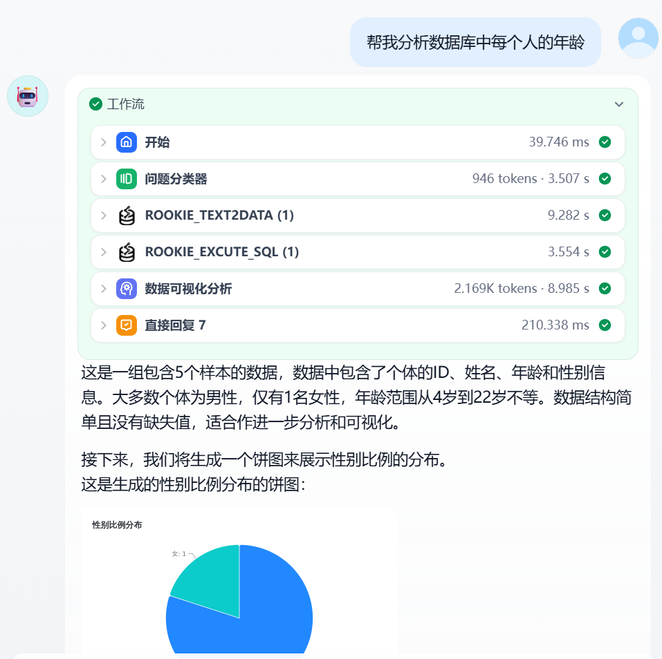
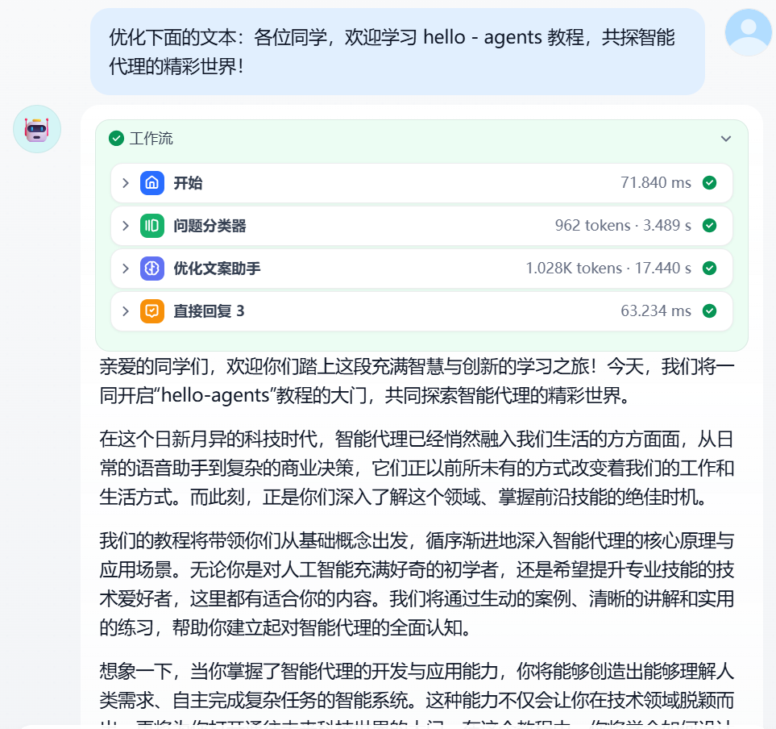
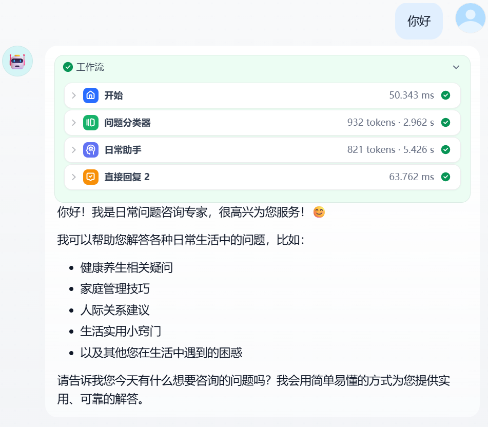
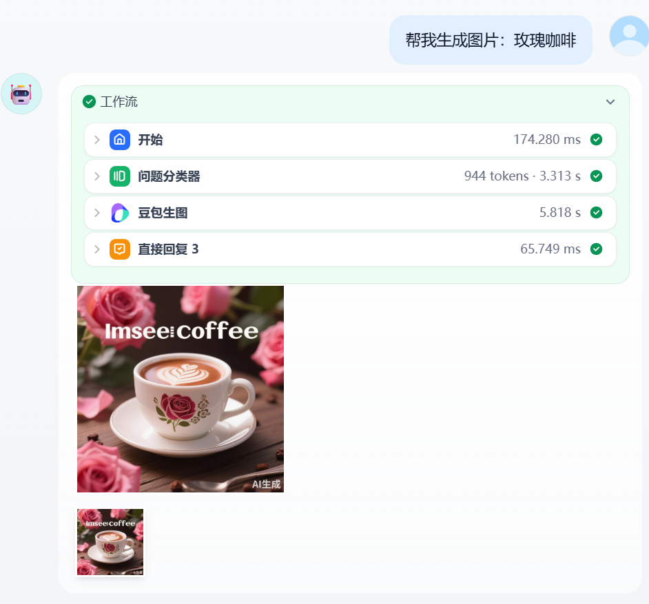
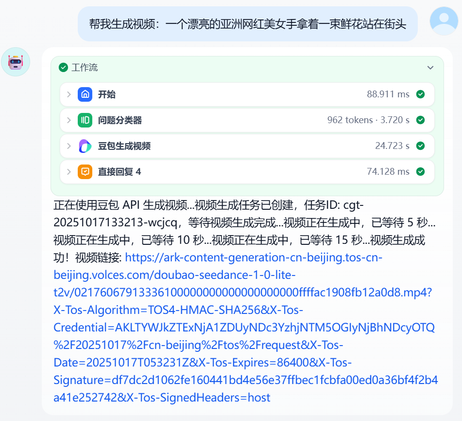
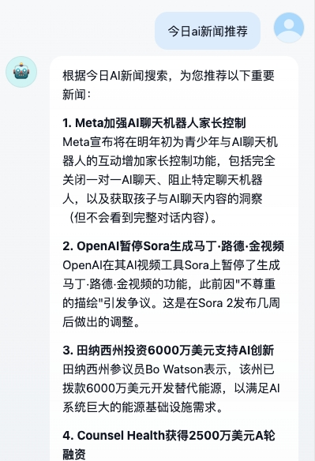
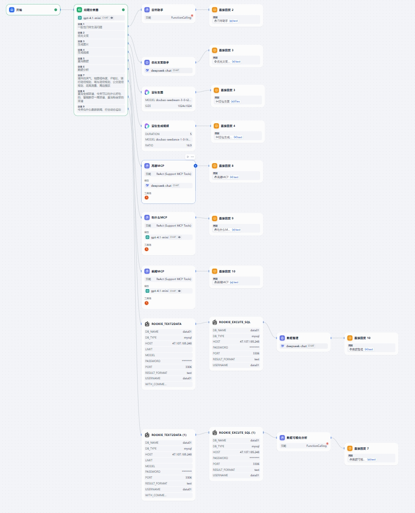

# 超级智能个人助手（在 Dify 平台上的部署说明）

## 项目简介
这是一个基于 Dify 平台的多功能智能体集合（advanced-chat 模式），包含日常咨询、文案优化、图片生成、生图/视频生成、新闻摘要和数据分析等能力。工作流由问题分类器路由到不同子智能体（agents），并通过若干第三方/自研插件（如 deepseek、doubao、rookie_text2data）完成具体任务。

## 适用场景
- 企业/个人在 Dify 上快速搭建垂类智能助手
- 支持文件上传、数据分析（SQL 执行）、生成图片/视频、多模态交互
- 可作为客服、内容生成、数据分析等场景的智能中台

## 主要功能亮点
- 自动问题分类：路由用户问题到合适的 agent（如日常助手、文案助手、生成图片/视频、数据分析等）。
- 多工具集成：集成 doubao 图像/视频生成、rookie_text2data 文本到数据、ROOKIE_EXECUTE_SQL 执行数据库查询等。
- 文件上传支持：允许本地或远程上传图片/文档（详见 workflow 配置的上传限制）。
- 语音支持：启用 STT（speech_to_text）和 TTS（text_to_speech）选项以实现语音交互。
- 检索支持：启用 retriever 以接入外部知识库或文档库。

## 架构概览
系统通过一个中心的工作流（workflow）驱动：
- 开始 -> 问题分类器 -> 对应 agent -> 调用工具/模型 -> 生成回答

在 yml 中可见的关键组件：
- question-classifier（问题分类器）
- 多个 agent（eg. 日常助手、文案助手、生成图片/视频、数据分析助手等）
- 工具/插件（deepseek-chat、doubao_image、rookie_text2data、ROOKIE_EXECUTE_SQL）

示意图参考：智能体的编排架构图.jpg

## 依赖（在 Dify 平台的插件/集成）
从配置中摘录的重要依赖：
- langgenius/deepseek: 深度对话 agent 引擎
- allenwriter/doubao_image: 图像/视频生成功能
- jaguarliuu/rookie_text2data: 文本到表格/数据解析
- ROOKIE_EXECUTE_SQL: 数据库执行（MySQL 等）

## workflow 配置要点（基于 yml）
- 模式：advanced-chat
- 文件上传：允许 .JPG/.PNG/.GIF/.WEBP/.SVG，支持本地文件与远程 URL，limits 在 yml 中有详细数值（image_file_size_limit、video_file_size_limit 等）。
- 建议问题（suggested_questions）已预配置，便于用户引导体验。
- speech_to_text 与 text_to_speech 已启用（可根据需要关闭或配置语言/voice）。
- retriever_resource 已启用以支持知识检索。

## 配置与部署到 Dify（步骤）
1. 登录 Dify 控制台。
2. 新建应用（Advanced Chat）并选择导入 YAML（将本仓库中的 `超级智能个人助手.yml` 导入）。
3. 在依赖市场中检查并授权/安装所需插件（deepseek、doubao、rookie 等）。
4. 配置环境变量与密钥：
   - 若使用外部数据库，请在 Dify 的环境变量中配置 DB_HOST/PORT/USER/PASS 等（参考 yml 中的 ROOKIE_EXECUTE_SQL 配置）。
   - 为 doubao/图像视频服务配置相应 API Key/凭证（如果需要）。
5. 检查文件上传限制与存储设置，确认文件存储（本地/远程）可用。
6. 部署并在 Dify 控制台打开测试，会话即可交互验证。

## 使用示例（基于效果图）
- 数据分析：
  用户：帮我分析数据库中每个人的年龄
  流程：问题分类器 -> ROOKIE_TEXT2DATA 将文本转换为表格数据 -> ROOKIE_EXECUTE_SQL 执行查询 -> 数据可视化分析 -> 返回图表（饼图/柱状图等）
  效果图：数据分析助手演示.png

- 图片生成（生图）：
  用户：帮我生成图片：玫瑰咖啡
  流程：问题分类器 -> 豆包/生图工具（doubao） -> 返回图片并展示缩略图
  效果图：生图助手演示效果.png

- 视频生成：
  用户：帮我生成视频：一个漂亮的亚洲网红美女手拿一束鲜花站在街头
  流程：问题分类器 -> 豆包视频生成 -> 返回生成任务链接和最终视频 URL
  效果图：视频助手演示效果.png

- 文案优化：
  用户：优化文本：...（输入）
  流程：问题分类器 -> 优化文案助手（deepseek-chat） -> 返回润色后的文案
  效果图：文案助手演示效果.png

- 新闻摘要：
  用户：今日 ai 新闻推荐
  流程：问题分类器 -> 新闻助手 -> 返回要点式新闻摘要
  效果图：新闻助手.png

- 日常咨询（常见问答）
  用户：你好
  流程：问题分类器 -> 日常助手 -> 返回问候与能力说明
  效果图：日常助手演示效果.png

## 数据源与数据库说明
- ROOKIE_TEXT2DATA 用于将自然语言或上传的表格文本解析为结构化数据。
- ROOKIE_EXECUTE_SQL 用于向指定数据库发送 SQL 查询（yml 中包含示例 DB_NAME/DB_TYPE/HOST/PORT/USERNAME 等字段）。
- 部署前请确认数据库可从 Dify 后端访问（网络/白名单/安全组设置）。

## 安全与隐私建议
- 不要在公开仓库中提交 API Key 或数据库密码；在 Dify 中使用环境变量或密钥管理功能。
- 对用户上传文件做类型与大小限制（yml 已设置），并在需要时对敏感信息做脱敏处理。
- 若启用检索器（retriever），确保外部知识源符合合规要求。

## 调试与常见问题
- 若某个 agent 未触发，检查问题分类器的分类标签（yml 中 classes 配置）。
- 图像/视频生成失败：检查 doubao 服务的配额、API Key 和任务监控日志。
- 数据库连接错误：确认 DB 地址和端口可达，且凭证正确；检查 Dify 后端网络策略。

## 扩展与定制建议
- 增加自定义 skill 或 webhook 以对接内部服务（如 CRM、内部知识库）。
- 增强问答路由策略：结合用户上下文和历史会话改进问题分类模型。
- 增加监控与统计埋点，观察各 agent 的调用频率和失败率以优化成本。

## 附件与资源
- 配置文件：超级智能个人助手.yml（工作流、agent、工具与限制在其中定义）
- 示例效果图：
  - 数据分析： 
  - 文案助手： 
  - 日常助手： 
  - 生图助手： 
  - 视频助手： 
  - 新闻助手： 
  - 编排架构图： 

---

